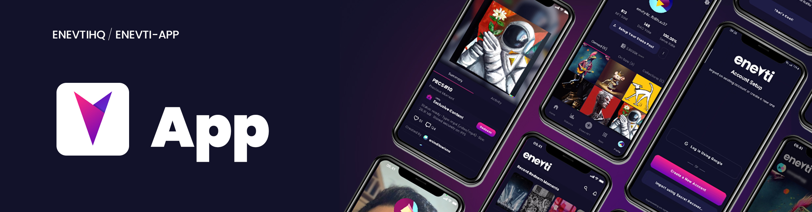

<a name="readme-top"></a>



# Enevti App


[](http://www.apache.org/licenses/LICENSE-2.0)
[](https://twitter.com/enevtihq)

[Enevti.com](https://enevti.com/) is an award-winning web3 social media super app with real-world NFT utility!

Enevti App is the main user interface for [Enevti Protocol](http://link.enevti.com/whitepaper), that written in React Native and primarily build for iOS and Android. In the future, users will be able to buy, collect, redeem, explore, stake, even vote. All of Enevti's user's needs are available in one single place!

## Polaris Phase (Decentralization)

We have completed the [Sol Phase](https://enevti.com/roadmap/), where we finish the development of the MVP as the main foundation of future products. You can read more about our MVP on our [blog post](https://blog.enevti.com/lets-meet-enevti-com-mobile-app-alpha-version-92391f87cc8a), as well as development updates on [wallet feature](https://blog.enevti.com/enevti-com-development-update-introducing-built-in-wallet-6a30a268f1cc), and [on-chain social features](https://blog.enevti.com/enevti-com-development-update-introducing-on-chain-nft-social-features-547298dcaf84).

We are currently working on the [Polaris Phase](https://enevti.com/roadmap/) that will bring mainnet, and integration with Lisk ecosystem as an interoperable sidechain.

<!-- TABLE OF CONTENTS -->
<details>
   <summary>Table of Contents</summary>
   <ol>
      <li>
         <a href="#enevti-app">About The Project</a>
         <ul>
            <li><a href="#polaris-phase-decentralization">Roadmap</a></li>
         </ul>
      </li>
      <li>
         <a href="#pre-installation">Pre-Installation</a>
         <ul>
            <li><a href="#ios">iOS</a></li>
            <li><a href="#android">Android</a></li>
         </ul>
      </li>
      <li>
         <a href="#installation">Installation</a>
      </li>
      <li>
         <a href="#third-party-service">Third Party Service</a>
         <ul>
            <li><a href="#nftstorage-api-key">NFT.STORAGE API KEY</a></li>
            <li><a href="#web3storage-api-key">WEB3.STORAGE API KEY</a></li>
         </ul>
      </li>
      <li>
         <a href="#run">Run</a>
         <ul>
            <li><a href="#run-on-android">Run on Android</a></li>
            <li><a href="#run-on-ios-macos-with-intel-chip">Run on iOS (MacOS with Intel chip)</a></li>
            <li><a href="#run-on-ios-macos-with-Apple-chip">Run on iOS (MacOS with Apple chip)</a></li>
         </ul>
      </li>
      <li><a href="#license">License</a></li>
   </ol>
</details>

<!-- PRE-INSTALLATION -->

## Pre-Installation

The prerequisites to install and run Enevti App from source using the different tagged releases are listed bellow. If you don't have them installed on your machine, please run the attached commands from your terminal.

- [Brew](https://brew.sh/)

  ```bash
  $ /bin/bash -c "$(curl -fsSL https://raw.githubusercontent.com/Homebrew/install/HEAD/install.sh)"
  ```

- [Git](https://git-scm.com/)

  ```bash
  $ brew install git
  ```

- [Node.js](https://nodejs.org/en/) (recommended 14.9.0)

  ```bash
  $ brew install node
  ```

- [NVM](https://github.com/nvm-sh/nvm)

  ```bash
  $ brew install nvm
  ```

  Remember to follow Brew additional steps for enabling NVM fully. After running `brew install nvm`, Brew will detail this steps.

- [NPM](https://www.npmjs.com/) (recommended 6.14.16)

  ```bash
  $ nvm install-latest-npm
  ```

  `npm` is shipped with Node.js. But to have a specific version installed see [here](https://stackoverflow.com/questions/9755841/how-can-i-change-the-version-of-npm-using-nvm).

- [Watchman](https://facebook.github.io/watchman/docs/install.html)

  ```bash
  $ brew install watchman
  ```

<p align="right">(<a href="#readme-top">back to top</a>)</p>

### iOS

- Install the latest version of [Xcode](https://apps.apple.com/ng/app/xcode/id497799835?mt=12)

<p align="right">(<a href="#readme-top">back to top</a>)</p>

### Android

- Install [Android Studio](https://developer.android.com/studio/index.html), which sould have these options checked installed:
  - Android SDK
  - Android SDK Platform
  - Performance (Intel ® HAXM)
  - Android Virtual Device
- Install the Android SDK. Consider these configurations:
  - compileSdkVersion: 31
  - buildToolsVersion: 30.0.2

<p align="right">(<a href="#readme-top">back to top</a>)</p>

<!-- INSTALLATION -->

## Installation

On your terminal, go to the directory you want to install Enevti App and run:

```bash
git clone https://github.com/enevtihq/enevti-app
cd enevti-app
npm install
npm run link
```

<p align="right">(<a href="#readme-top">back to top</a>)</p>

<!-- THIRD-PARTY-SERVICE -->

## Third Party Service

Enevti App use several third-party service that can be configured through environment variable. To configure these service, please create a `.env` file on the project root folder, containing these information:

```
NFT_STORAGE_API_KEY=<insert value here>
WEB3_STORAGE_API_KEY=<insert value here>
```

please note that this step is optional. However, corresponding features that need these third-party services may not work

<p align="right">(<a href="#readme-top">back to top</a>)</p>

### NFT.STORAGE API KEY

Enevti App uses [nft.storage](https://nft.storage/) to store NFT data when users `create a new NFT`. Please refer to their [Documentation](https://nft.storage/docs/quickstart/#get-an-api-token) on how to obtain these API key.

<p align="right">(<a href="#readme-top">back to top</a>)</p>

### WEB3.STORAGE API KEY

Enevti App uses [web3.storage](https://web3.storage/) to store text data when users `leave a comment`. Please refer to their [Documentation](https://web3.storage/docs/how-tos/generate-api-token/) on how to obtain these API key.

<p align="right">(<a href="#readme-top">back to top</a>)</p>

<!-- RUN -->

## Run

To run the metro bundler:

```bash
$ npm start
```

<p align="right">(<a href="#readme-top">back to top</a>)</p>

### Run on Android

To run android:

```bash
$ npm run android
```

<p align="right">(<a href="#readme-top">back to top</a>)</p>

### Run on iOS (MacOS with Intel chip)

To run the app on ios, you have to install `pods`.

For this, just run:

```bash
$ npx pod-install
$ npm run ios
```

<p align="right">(<a href="#readme-top">back to top</a>)</p>

### Run on iOS (MacOS with Apple chip)

If your machine has the [Apple Silicon](https://support.apple.com/en-us/HT211814) chip (not Intel), you will have to run some additional steps, which we hope are going to be solved in a short term while the new chip is more widely adopted.

The process is:

1. Locate in Terminal app in Finder.
2. Right-click and click on _Get Info_
3. Check the Open using _Rosetta_ checkbox.
4. Quit Terminal app and run it again
5. Go to your app folder and run `sudo gem install ffi`
6. Run `npx pod-install`
7. Run `npm run ios`

More details [here](https://armen-mkrtchian.medium.com/run-cocoapods-on-apple-silicon-and-macos-big-sur-developer-transition-kit-b62acffc1387).

<p align="right">(<a href="#readme-top">back to top</a>)</p>

<!-- LICENSE -->

## License

Licensed under the Apache License, Version 2.0 (the "License");
you may not use this file except in compliance with the License.
You may obtain a copy of the License at

    http://www.apache.org/licenses/LICENSE-2.0

Unless required by applicable law or agreed to in writing, software
distributed under the License is distributed on an "AS IS" BASIS,
WITHOUT WARRANTIES OR CONDITIONS OF ANY KIND, either express or implied.
See the License for the specific language governing permissions and
limitations under the License.

<p align="right">(<a href="#readme-top">back to top</a>)</p>
